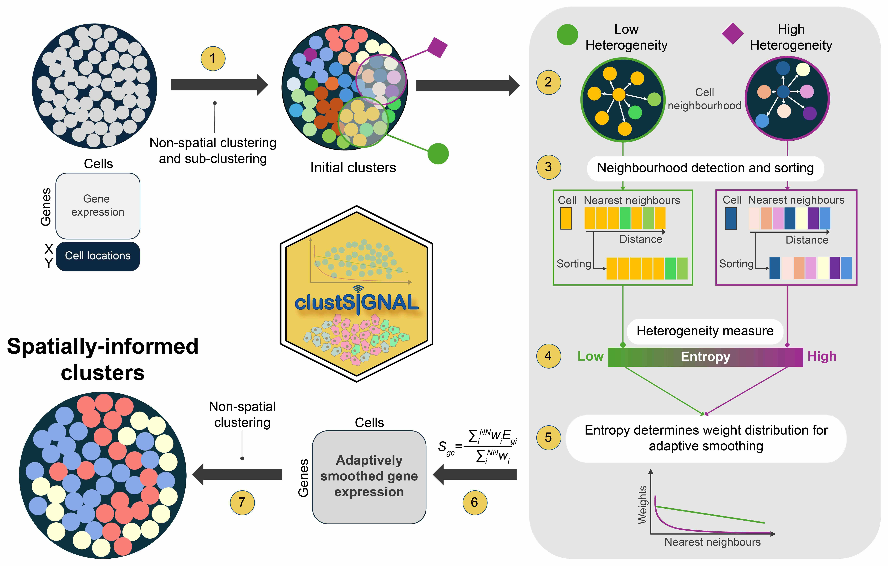

## Workshop overview


## Pre-requisites to run the workshop

The attendees are expected to have:

1. Experience with R programming, and
2. Familiarity with SingleCellExperiment and/or SpatialExperiment objects.


## Content and objective
Below is a list of tasks we will go through during the workshop, and what the attendees can expect to learn from them.

| Task                            | Time   | Objective                         |
|---------------------------------|--------|-----------------------------------|
| Concept behind clustSIGNAL      | 15 min | Description of how clustSIGNAL works as a spatial clustering method. How does clustSIGNAL 
|                                 |        | embed spatial information into the data and how that affects clustering.
| Method parameters               | 5 min  | Learn about the different clustering parameters available in clustSIGNAL, and understand 
|                                 |        | how they can affect the clustering output. 
| How to run clustSIGNAL          | 10 min | Perform clustering on spatial transcriptomics data with clustSIGNAL. Also, learn what sort
|                                 |        | of outputs can be obtained from running the method.
| Assessing relevance of clusters | 10 min | Investigate the biological relevance of the clusters obtained from running clustSIGNAL.
| Exploring clustSIGNAL outputs   | 10 min | Learn about how some of the data generated by clustSIGNAL can be useful for other analyses.


## Notes

The clustSIGNAL R package is available to download and install from [github/SydneyBioX/clustSIGNAL](https://github.com/SydneyBioX/clustSIGNAL).

The attendees can bring their own data, and run the method locally. 


## 1.  Concept behind clustSIGNAL


clustSIGNAL (***clust***ering of ***S***patially ***I***nformed ***G***ene expression with ***N***eighbourhood ***A***dapted ***L***earning) is a cell-type clustering method for subcellular spatial transcriptomics data. It aims to address data sparsity by performing an adaptive smoothing approach to generate modified gene expressions that are embedded with spatial context and neighbourhood composition information.

To capture neighbourhood composition of each cell, we used entropy as a measure of the "domainness" of cell neighbourhoods - the more homogeneous a neighbourhood the lower its entropy and the more heterogeneous a neighbourhood the higher its entropy. The entropy values were then used to generate cell neighbourhood-specific weights to perform an adaptive smoothing of gene expression, such that smoothing was performed over more cells in homogeneous neighbourhoods, but heterogeneous neighbourhoods were smoothed over a much smaller region. 




**Figure: clustSIGNAL method overview.**

The core steps involved in the method are sequential:

**1.** The method starts with non-spatial clustering and subclustering (default louvain clustering) to classify cells into subclusters that we refer to as "intial clusters".
*Function: clustSIGNAL::p1_clustering()*

**2.** The neighbourhood of each cell is defined in terms of their "intial clusters" composition.
*Function: clustSIGNAL::neighbourDetect()*

**3.** The cells in the neighbourhood are also sorted and rearranged so that the neighbours belonging to the same "intial clusters" group as the index cell are placed closer to it.
*Function: clustSIGNAL::neighbourDetect()*

**4.** Neighbourhood “domainness” is measured as entropy, where high entropy values indicate more heterogeneous neighbourhoods and low entropy values indicate more homogeneous neighbourhoods.
*Function: clustSIGNAL::entropyMeasure()*

**5.** The entropy values are used to generate weight distributions specific to each neighbourhood.
*Function: clustSIGNAL::adaptiveSmoothing()*

**6.** The gene expressions of cells are adaptively smoothed using the entropy-guided weight distributions; cells in heterogeneous neighbourhoods (high entropy) undergo smoothing over a smaller region, whereas cells in homogeneous neighbourhoods (low entropy) undergo smoothing over a larger region.
*Function: clustSIGNAL::adaptiveSmoothing()*

**7.** Non-spatial clustering is performed with adaptively smoothed gene expression to generate clustSIGNAL clusters that represent cell types.
*Function: clustSIGNAL::p2_clustering()*


## 2.  Method parameters

The clustSIGNAL package uses a SpatialExperiment object as input. We provide users with a number of parameters to explore and experiment with, as well as prior tested default values for quick runs. clustSIGNAL can be used for single sample or multisample analysis with just one function call. Below is the list of the parameters offered and their possible values:

-   **spe** - SpatialExperiment object with cell [spatial coordinates](## "Stored in the spatialCoords(spe) cell location section") matrix and [normalized counts](## "Stored under logcounts(spe) assay") of gene expression.

-   **samples** - column name in [cell metadata](## "Stored in the colData(spe) section") containing sample names.

-   **cells** - column name in [cell metadata](## "Stored in the colData(spe) section") containing cell IDs.

-   **dimRed** - dimensionality reduction method name in [low embedding data](## "Stored in the reducedDimNames(spe) embeddings section"). Default value is "None", in which case PCA is calculated and used as low dimension data.

-   **batch** - whether batch correction should be performed. Default value is FALSE.

-   **batch_by** - column name in [cell metadata](## "Stored in the colData(spe) section") containing the groups by which to perform batch correction.

-   **NN** - neighbourhood size in terms of the number of nearest neighbours to consider. Value should be \> 1. Default value is 30.

-   **kernel** - type of weight distribution to use. Can be Gaussian (default) or exponential distribution.

-   **spread** - value of distribution parameter - standard deviation of Gaussian distribution or rate of exponential distribution. Default value is 0.05, recommended for Gaussian distribution. For exponential distribution, recommended value is 20.

-   **sort** - whether cell neighbourhoods should be sorted by their 'putative cell type' grouping. Default value is True.

-   **threads** - number of cpus to use for parallel runs. Default value is 1.

-   **outputs** - choice of output types. Default value is 'c' for data frame of cell IDs and cluster numbers. Other possible value is "a" for a list of dataframe of clusters plus final SpatialExperiment object.

-   **clustParams** - parameter options for TwoStepParam clustering methods in the bluster package. The clustering parameters are in the order - centers (centers) for clustering with KmeansParam, centers (centers) for sub-clustering clusters with KmeansParam, maximum iterations (iter.max) for clustering with KmeansParam, k values (k) for clustering with NNGraphParam, and community detection method (cluster.fun) to use with NNGraphParam.


## Installation

To install clustSIGNAL from [GitHub](https://github.com/SydneyBioX/clustSIGNAL):

``` r
# install.packages("devtools")
devtools::install_github("SydneyBioX/clustSIGNAL")
```
